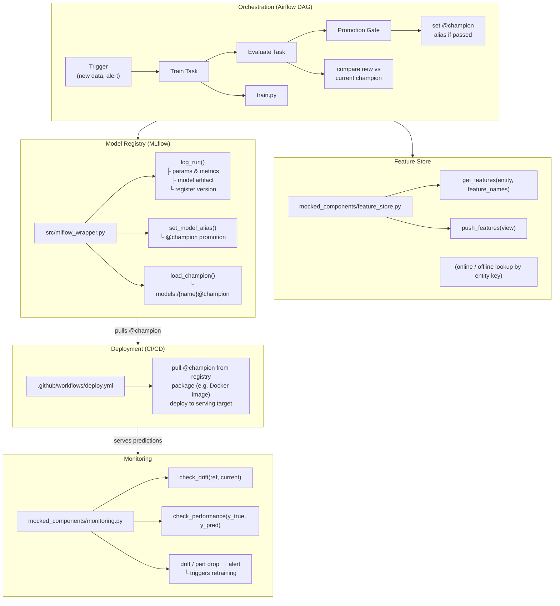
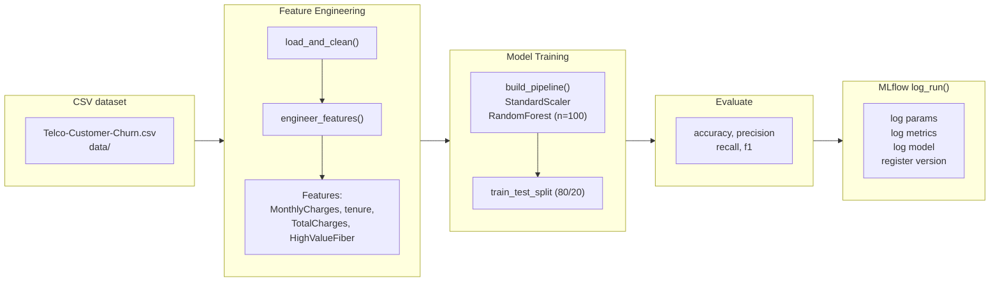

# Architecture

## System Overview

## Data & Training Flow

## Component Status

| Component | Status | Location |
|---|---|---|
| Training / Feature Eng. | **Implemented** | `src/train.py` |
| Model Registry (MLflow) | **Implemented** | `src/mlflow_wrapper.py` |
| Feature Store | Stub | `mocked_components/feature_store.py` |
| Monitoring | Stub | `mocked_components/monitoring.py` |
| Orchestration (Airflow) | Stub | `mocked_components/airflow_dag_mock.py` |
| Deployment (CI/CD) | Stub | `.github/workflows/deploy.yml` |

## Mapping to Task Requirements

| Task | Delivered by | Role of Training |
|------|--------------|------------------|
| **1. Model Registry** | Model Registry (MLflow) | Training produces the model that gets logged (version, metrics, params, timestamp) and registered. |
| **2. Feature Store** | Feature Store | Supplies features for both training and inference; Training (and Orchestration) consume them. |
| **3. Monitoring** | Monitoring | Tracks inference volume, latency, performance/drift; alerts can trigger retraining. |
| **4. Orchestration** | Orchestration (Airflow) | Runs the **retraining pipeline**: trigger → **Train Task** (training step) → evaluate → register new version. Training is the ML step inside this pipeline. |
| **5. Deployment** | Deployment (CI/CD) | Containerized inference; pulls `@champion` from registry. No direct link to Training. |

So the **Training** component is logical: it is the retraining step (task 4) and the producer of models for the Registry (task 1).

## Key Design Decisions

- **Deployment is decoupled from retraining** -- the deploy step always pulls from the `@champion` registry alias, never a specific version.
- **Orchestration owns the lifecycle** -- Airflow manages train > evaluate > promote; infrastructure concerns stay separate.
- **Monitoring closes the loop** -- drift or performance degradation triggers alerts that can kick off a new DAG run.
