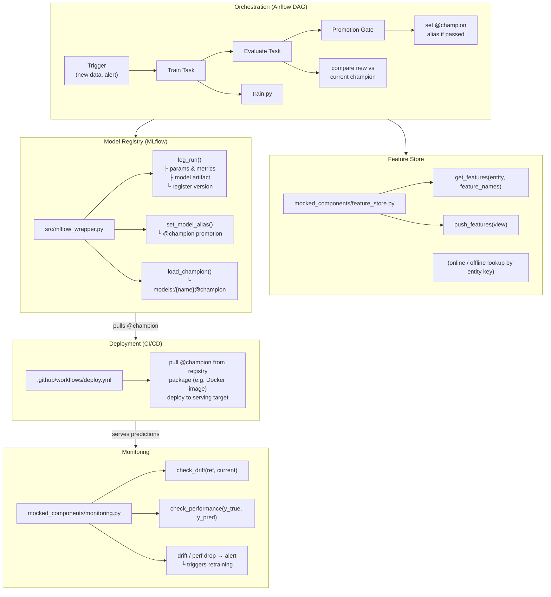

# System Overview

```mermaid
flowchart TB
    subgraph Orchestration["Orchestration (Airflow DAG)"]
        direction LR
        Trigger["Trigger<br/>(new data, alert)"]
        TrainTask["Train Task"]
        EvalTask["Evaluate Task"]
        PromoGate["Promotion Gate"]
        Trigger --> TrainTask --> EvalTask --> PromoGate
        TrainTask --> TrainPy["train.py"]
        EvalTask --> Compare["compare new vs<br/>current champion"]
        PromoGate --> Alias["set @champion<br/>alias if passed"]
    end

    subgraph FeatureStore["Feature Store"]
        FS["mocked_components/feature_store.py"]
        Get["get_features(entity, feature_names)"]
        Push["push_features(view)"]
        FS --> Get
        FS --> Push
        note["(online / offline lookup by entity key)"]
    end

    subgraph ModelRegistry["Model Registry (MLflow)"]
        MR["src/mlflow_wrapper.py"]
        LogRun["log_run()<br/>├ params & metrics<br/>├ model artifact<br/>└ register version"]
        SetAlias["set_model_alias()<br/>└ @champion promotion"]
        LoadChamp["load_champion()<br/>└ models:/{name}@champion"]
        MR --> LogRun
        MR --> SetAlias
        MR --> LoadChamp
    end

    subgraph Deployment["Deployment (CI/CD)"]
        Deploy[" .github/workflows/deploy.yml"]
        DeploySteps["pull @champion from registry<br/>package (e.g. Docker image)<br/>deploy to serving target"]
        Deploy --> DeploySteps
    end

    subgraph Monitoring["Monitoring"]
        Mon["mocked_components/monitoring.py"]
        Drift["check_drift(ref, current)"]
        Perf["check_performance(y_true, y_pred)"]
        Alert["drift / perf drop → alert<br/>└ triggers retraining"]
        Mon --> Drift
        Mon --> Perf
        Mon --> Alert
    end

    Orchestration --> FeatureStore
    Orchestration --> ModelRegistry
    ModelRegistry -->|"pulls @champion"| Deployment
    Deployment -->|"serves predictions"| Monitoring
```
